# SmartLearn 全链路数据流图

```mermaid
flowchart TD
    SB["<b>SpringBoot 业务后端</b><br/>发送题目 + 用户答案"]
    
    subgraph L0["第 0 层：上游入参"]
        REQ["{<br/>  user_id: 'spring_user_001',<br/>  user_answer: 'B',<br/>  question: {<br/>    id: 'q_001',<br/>    type: 'single_choice',<br/>    content: '动态规划的核心要素不包括...',<br/>    options: ['A.状态定义','B.状态转移方程',<br/>             'C.贪心选择性质','D.边界条件'],<br/>    correct_answer: 'C',<br/>    knowledge_point_ids: ['kp_dp','kp_greedy'],<br/>    difficulty: 3<br/>  }<br/>}"]
    end

    SB --> REQ
    REQ --> L1

    subgraph L1["第 1 层：规则判题 _judge()"]
        L1_IN["输入: type='single_choice'<br/>user_answer='B'<br/>correct_answer='C'"]
        L1_LOGIC["'B'.strip().upper()<br/>== 'C'.strip().upper()<br/>→ ❌ false"]
        L1_OUT["输出: is_correct = false<br/><i>耗时 &lt;1ms，不经过 LLM</i>"]
        L1_IN --> L1_LOGIC --> L1_OUT
    end

    L1_OUT --> L2

    subgraph L2["第 2 层：LLM 深度分析 Qwen-Max"]
        L2_SYS["<b>System Prompt</b><br/>要求返回 JSON：<br/>{<br/>  is_correct,<br/>  error_analysis: {<br/>    explanation,<br/>    error_type,<br/>    error_detail<br/>  },<br/>  weak_point_analysis: [{<br/>    knowledge_point_id,<br/>    knowledge_point_name,<br/>    current_mastery,<br/>    reason<br/>  }]<br/>}"]
        L2_USR["<b>User Prompt</b><br/>题目ID: q_001<br/>涉及知识点ID: kp_dp, kp_greedy<br/>题目内容: 动态规划的核心要素...<br/>正确答案: C / 学生答案: B<br/>判题结果: 错误"]
        L2_API["<b>DashScope API</b><br/>POST compatible-mode/v1/chat/completions<br/>model: qwen-max<br/>temperature: 0.3"]
        L2_OUT["<b>LLM 原始输出</b><br/>```json<br/>{<br/>  is_correct: false,<br/>  error_analysis: {<br/>    explanation: '核心三要素...',<br/>    error_type: '概念混淆',<br/>    error_detail: '选了B，混淆了DP与贪心'<br/>  },<br/>  weak_point_analysis: [<br/>    { id:'kp_dp', name:'动态规划',<br/>      mastery:0.6, reason:'...'},<br/>    { id:'kp_greedy', name:'贪心算法',<br/>      mastery:0.4, reason:'...'}<br/>  ]<br/>}<br/>```"]
        L2_SYS --> L2_API
        L2_USR --> L2_API
        L2_API --> L2_OUT
    end

    L2_OUT --> L3

    subgraph L3["第 3 层：LLM 输出解析 parse_llm_json()"]
        L3_LOGIC["① 尝试直接 json.loads<br/>② 失败→提取 ```json...```<br/>③ 失败→提取 ```...```<br/>④ 彻底失败→返回 {}"]
        L3_OUT["输出: 结构化 dict<br/>{<br/>  is_correct: false,<br/>  error_analysis: { ... },<br/>  weak_point_analysis: [<br/>    { knowledge_point_id:'kp_dp',<br/>      knowledge_point_name:'动态规划',<br/>      current_mastery:0.6,<br/>      reason:'...' },<br/>    { knowledge_point_id:'kp_greedy',<br/>      knowledge_point_name:'贪心算法',<br/>      current_mastery:0.4,<br/>      reason:'...' }<br/>  ]<br/>}"]
        L3_LOGIC --> L3_OUT
    end

    L3_OUT --> L4

    subgraph L4["第 4 层：Neo4j 补全 _enrich_weak_points()"]
        L4_LOOP["遍历 knowledge_point_ids<br/>['kp_dp', 'kp_greedy']"]
        L4_CYPHER["<b>Cypher 查询</b><br/>MATCH (k:KnowledgePoint {id: 'kp_dp'})<br/>RETURN k {.id,.name,.description,.difficulty,.category}<br/><br/>→ { id:'kp_dp', name:'动态规划',<br/>    difficulty:4, category:'算法设计' }<br/><br/>MATCH (k:KnowledgePoint {id: 'kp_greedy'})<br/>→ { id:'kp_greedy', name:'贪心算法',<br/>    difficulty:3, category:'算法设计' }"]
        L4_MERGE["<b>合并策略</b><br/>· LLM 已分析该 ID → 用 LLM 的 mastery<br/>· LLM 遗漏该 ID → 默认值：<br/>  答对=0.7 / 答错=0.3<br/>· 名称以 Neo4j 为准<br/>  （防止 LLM 编造名称）"]
        L4_OUT["输出: 可信薄弱点列表<br/>[<br/>  { knowledge_point_id:'kp_dp',<br/>    name:'动态规划' ← Neo4j,<br/>    mastery:0.6     ← LLM,<br/>    reason:'...'    ← LLM },<br/>  { knowledge_point_id:'kp_greedy',<br/>    name:'贪心算法' ← Neo4j,<br/>    mastery:0.4     ← LLM,<br/>    reason:'...'    ← LLM }<br/>]"]
        L4_LOOP --> L4_CYPHER --> L4_MERGE --> L4_OUT
    end

    L4_OUT --> L5

    subgraph L5["第 5 层：学习路径规划 generate_learning_path()"]
        L5A["<b>5a. 排序</b><br/>按 mastery 升序<br/>最弱的先学<br/><br/>sorted = [<br/>  ('kp_greedy', 0.4),<br/>  ('kp_dp',     0.6)<br/>]"]
        L5B["<b>5b. 查薄弱点本体</b><br/>Neo4j: get_knowledge_point()<br/><br/>→ kp_greedy: '贪心算法'<br/>→ kp_dp:     '动态规划'<br/><br/>seen = {'kp_greedy','kp_dp'}"]
        L5C["<b>5c. 追溯前置依赖</b><br/>Neo4j: get_prerequisites()<br/>MATCH (k)-[:PREREQUISITE*1..]->(p)<br/><br/>kp_greedy → [] (无前置)<br/>kp_dp → ['分治法']<br/><br/>seen += {'kp_dc'}<br/>路径: 贪心算法→动态规划→分治法"]
        L5D["<b>5d. LLM 生成建议</b><br/>Qwen-Max<br/><br/>输入: '学习路径：贪心算法→<br/>动态规划→分治法...'<br/><br/>输出:<br/>贪心算法：先理解贪心选择性质<br/> 和最优子结构两大要素<br/>动态规划：对比贪心，重点掌握<br/> 自底向上的递推方式<br/>分治法：以归并排序为例理解<br/> 分解-解决-合并三步曲"]
        L5A --> L5B --> L5C --> L5D
    end

    L5D --> L5_OUT

    subgraph L5_OUT_DATA["第 5 层输出"]
        L5_OUT["[<br/>  { order:1,<br/>    knowledge_point: {<br/>      id:'kp_greedy',<br/>      name:'贪心算法', ...<br/>    },<br/>    reason: '先理解贪心选择性质<br/>     和最优子结构两大要素'<br/>  },<br/>  { order:2,<br/>    knowledge_point: {<br/>      id:'kp_dp',<br/>      name:'动态规划', ...<br/>    },<br/>    reason: '对比贪心，重点掌握<br/>     自底向上的递推方式'<br/>  },<br/>  { order:3,<br/>    knowledge_point: {<br/>      id:'kp_dc',<br/>      name:'分治法', ...<br/>    },<br/>    reason: '以归并排序为例理解<br/>     分解-解决-合并三步曲'<br/>  }<br/>]"]
    end

    L5_OUT --> L6

    subgraph L6["第 6 层：组装最终响应 AnswerAnalysisResponse"]
        L6_ASSEMBLE["<b>字段来源汇总</b><br/>· user_id        ← 入参直传<br/>· question_id    ← 入参直传<br/>· is_correct     ← 第 1 层<br/>· error_analysis ← 第 3 层 (LLM)<br/>· weak_points    ← 第 4 层 (Neo4j+LLM)<br/>· learning_path  ← 第 5 层 (Neo4j+LLM)<br/>· generated_at   ← 当前时间戳"]
        L6_RESP["<b>JSON 响应 → SpringBoot</b><br/>{<br/>  user_id: 'spring_user_001',<br/>  question_id: 'q_001',<br/>  is_correct: false,<br/>  error_analysis: {<br/>    user_answer:'B', correct_answer:'C',<br/>    explanation:'核心三要素...',<br/>    error_type:'概念混淆',<br/>    error_detail:'选了B，混淆了DP与贪心'<br/>  },<br/>  weak_point_analysis: [ ... ],<br/>  learning_path: [ ... ],<br/>  generated_at: '2026-05-14T10:30:00'<br/>}"]
        L6_ASSEMBLE --> L6_RESP
    end

    style SB fill:#4a90d9,color:#fff
    style L1 fill:#e8f5e9,stroke:#4caf50
    style L2 fill:#fff3e0,stroke:#ff9800
    style L3 fill:#f3e5f5,stroke:#9c27b0
    style L4 fill:#e3f2fd,stroke:#2196f3
    style L5 fill:#fce4ec,stroke:#e91e63
    style L6 fill:#e0f2f1,stroke:#009688
```



---

## 各层职责速查

| 层 | 组件 | 输入 | 输出 | 外部依赖 |
|---|------|------|------|----------|
| ① | `_judge()` | type, user_answer, correct_answer | `is_correct: bool` | 无 |
| ② | `llm_service.chat()` | system + user prompt | JSON 文本 (含 ```json 包裹) | DashScope API |
| ③ | `parse_llm_json()` | LLM 原始文本 | 结构化 dict | 无 |
| ④ | `_enrich_weak_points()` + `kg_service` | knowledge_point_ids + LLM 分析 | 可信薄弱点列表 | Neo4j |
| ⑤ | `path_service.generate_learning_path()` | weak_points [(id, mastery)] | 排序学习路径 | Neo4j + Qwen-Max |
| ⑥ | `analysis.py` 路由 | 各层产出 | `AnswerAnalysisResponse` JSON | 无 |
